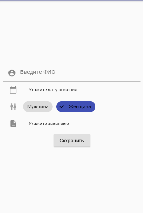

# HRS

Экзаменационный проект по теме: "Разработка программного комплекса для обработки сведений по учету работы отдела кадров предприятия."

## Функций

- Регистрация сотрудников
- Уволить сотрудников
- Зарегистрировать событие
- Просмотр событий
- Просмотр отчета по сотруднику

## Особенности

Подгрузка должностей производиться из [удаленного источника](https://jsoneditoronline.org/#left=cloud.259be5399b0b48969aa37372e86cb187)

Данные должны соответствовать следующему формату
```
    {
      "positions":[
        {"name" : "Преподаватель", "salary": 170},
        {"name" : "Администратор", "salary": 180},
        {"name" : "Уборщик", "salary": 140},
        {"name" : "Охранник", "salary": 120}
      ]
    }
```

### Описание полей
* `positions` массив статусов
* `name` название должности
* `salary` ставка в час

## Описание страниц и экранов

Далее будут описаны страницы и экраны приложения, и их предназначение.

### Страцница сотрудников

Страница отображает текущих трудоустроенных сотрудников.


### Страница событий

Страница отображает события, произошедшие с сотрудниками за период их работы
> Устроился, работает, отпуск, уволен


### Форма регистрации сотрудника

Экран позволяет произвести регистрацию нового сотрудника в системе.



## Описание функционала

Далее будет продемонстрирован функционал программы и описание.

### Регистраци сотрудника

Форма регистрации содержит следующие поля
* ФИО
* Дата рождения
* Пол
* Должность
> Для выбора должности открывается отдельный экран содержащий список.


### Уволить сотрудника

После выполнения операции, выбранные сотрудник исчезнет из списка и зарегистрируется событие увольнения.


### Регистраци события и просмотр отчета

После нажатия кнопки `Добавить событие` появится диалоговое окно с выбором события.
Для просмотра отчета о сотруднике нажмите кнопку `Детали`.
Отчет содержит основную информацию о сотруднике и его события.


## Работа с БД

В проекте используется БД SQLite.
Далее буду продемонстрированы вставки SQL запросов.

### Создание БД

```
CREATE TABLE position (id INTEGER PRIMARY KEY AUTOINCREMENT NOT NULL,name TEXT NOT NULL,salary INTEGER NOT NULL)
CREATE TABLE employee (
          id INTEGER PRIMARY KEY AUTOINCREMENT NOT NULL,
          fio TEXT NOT NULL,
          day_of_birth INTEGER NOT NULL,
          sex INTEGER NOT NULL,
          remove INTEGER DEFAULT 0,
          id_position INTEGER NOT NULL,
          FOREIGN KEY(id_position) REFERENCES position(id)
CREATE TABLE event (
          id INTEGER PRIMARY KEY AUTOINCREMENT NOT NULL,
          type TEXT NOT NULL,
          date INTEGER NOT NULL,
          id_employee INTEGER NOT NULL,
          FOREIGN KEY(id_employee) REFERENCES employee(id)
```

### Код для работы с БД

```
import 'dart:developer';

import 'package:flutter/foundation.dart';
import 'package:get_it/get_it.dart';
import 'package:hrs/domain/entities/employee.dart';
import 'package:hrs/domain/entities/event.dart';
import 'package:hrs/domain/entities/position.dart';
import 'package:sqflite/sqflite.dart';

class LocalDatabase{
  Database db;

  LocalDatabase(String name){
    _init(name);
  }

  // Инициализация БД
  @required
  _init(String name) async {
    if(db != null)
      return;
    db = await openDatabase(name, version: 1, onConfigure: (db) async {
      await db.execute('PRAGMA foreing_keys = ON');
    }, onCreate: (db, version) async{
      await db.execute('''CREATE TABLE position (
          id INTEGER PRIMARY KEY AUTOINCREMENT NOT NULL,
          name TEXT NOT NULL,
          salary INTEGER NOT NULL
          )''');
      await db.execute('''CREATE TABLE employee (
          id INTEGER PRIMARY KEY AUTOINCREMENT NOT NULL,
          fio TEXT NOT NULL,
          day_of_birth INTEGER NOT NULL,
          sex INTEGER NOT NULL,
          remove INTEGER DEFAULT 0,
          id_position INTEGER NOT NULL,
          FOREIGN KEY(id_position) REFERENCES position(id)
      )''');
      await db.execute('''CREATE TABLE event (
          id INTEGER PRIMARY KEY AUTOINCREMENT NOT NULL,
          type TEXT NOT NULL,
          date INTEGER NOT NULL,
          id_employee INTEGER NOT NULL,
          FOREIGN KEY(id_employee) REFERENCES employee(id)
      )''');
    });
    GetIt.I.signalReady(this);
  }

  //Добавить сотрудника
  Future addEmployee(Employee entity) async {
    try{
      return await db.transaction((thx) async {
        await thx.insert('position', entity.position.toMap());
        final List<Map<String, dynamic>> position = await thx.query('position');
        await thx.insert('employee', entity.toMap()..['id_position'] = position.last['id']);
        final List<Map<String, dynamic>> lastInsert = await thx.query('employee');
        await thx.insert('event', {
          'type' : 'Устроился на работу',
          'date' : DateTime.now().millisecondsSinceEpoch,
          'id_employee' : lastInsert.last['id']
        });
      });
    } on DatabaseException catch(e){
      log('Error:', error: e);
      return Future.error(e);
    }
  }
  
  //Уволить сотрудника
  Future removeEmployee(Employee entity) async {
    try{
      db.transaction((thx) async {
        await thx.update('employee', { 'remove' : 1 }, where: 'id = ?', whereArgs: [entity.id]);
        await thx.insert('event', {
          'type' : 'Уволен',
          'date' : DateTime.now().millisecondsSinceEpoch,
          'id_employee' : entity.id
        });
      });
    } on DatabaseException catch(e){
      log('Error:', error: e);
      return Future.error(e);
    }
  }
 
  //Список сотрудников
  Future<List<Employee>> getEmployees() async {
    try{
      final List<Map<String, dynamic>> result = await db.rawQuery('''SELECT
          employee.id, employee.fio, employee.day_of_birth, employee.sex,
          employee.id_position, position.name, position.salary 
          FROM employee LEFT JOIN position on employee.id_position = position.id WHERE employee.remove = ?''', [0]);
      return result.map<Employee>((map) => Employee.fromMap(map)).toList();
    } on DatabaseException catch(e){
      log('Error:', error: e);
      return Future.error(e);
    }
  }
  
  //Зафиксировать событие
  Future addEvent(Event entity) async {
    try{
      await db.insert('event', entity.toMap());
    } on DatabaseException catch(e){
      log('Error:', error: e);
      return Future.error(e);
    }
  }
  
  //Получить события для конкретного сотрудника
  Future<List<Event>> getEventForEmployee(int id) async {
    try{
      final List<Map<String, dynamic>> result = await db.rawQuery('''SELECT event.type, event.date, employee.id, 
      employee.fio, employee.day_of_birth, employee.sex,
      position.name, position.salary
      FROM event LEFT JOIN employee on event.id_employee = employee.id 
      LEFT JOIN position on employee.id_position = position.id WHERE employee.id = ?''', [id]);
      return result.map<Event>((map) => Event.fromMap(map)).toList();
    } on  DatabaseException catch(e){
      log('Error:', error: e);
      return Future.error(e);
    }
  }

  //Получить все события
  Future<List<Event>> getEvents() async {
    try{
      final List<Map<String, dynamic>> result = await db.rawQuery('''SELECT event.type, event.date, employee.id, 
      employee.fio, employee.day_of_birth, employee.sex,
      position.name, position.salary
      FROM event LEFT JOIN employee on event.id_employee = employee.id 
      LEFT JOIN position on employee.id_position = position.id''');
      return result.map<Event>((map) => Event.fromMap(map)).toList();
    } on DatabaseException catch(e){
      log('Error:', error: e);
      return Future.error(e);
    }
  }

  @required
  void dispose(){
    db.close();
  }
}
```